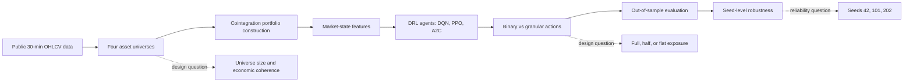

<p align="center">
  
</p>
<div align="center">
Cointegration-Based DRL Cryptocurrency Statistical Arbitrage
Asset-Universe Design + Action-Space Granularity + Seed-Level Robustness


</div>
---
What this repository is
This repository contains the replication package for the study:
> **Asset-Universe Design and Action-Space Granularity in Cointegration-Based Deep Reinforcement Learning for Cryptocurrency Statistical Arbitrage**
It reproduces the manuscript tables and figures from saved model-summary outputs, using a transparent workflow for table recreation, figure generation, result validation, checksum reporting, and Binance Public Data URL scaffolding.
The package evaluates whether a cointegration-based deep reinforcement learning trading layer is affected by two design choices that are often treated as secondary:
Which assets enter the cointegration universe?
What exposure choices are available to the DRL agent?
---
The idea in one picture
<p align="center">
  
</p>

---
Study design at a glance
Component	Design choice
Market data	30-minute USDT-denominated Binance spot OHLCV data
Training sample	2023-01-01 to 2024-12-10
Separation window	2024-12-11 to 2024-12-17
Out-of-sample test	2024-12-18 to 2025-05-17
Asset universes	Baseline 14, Broad 20, Payment-Coin 6, Layer-1 Platform 9
Portfolio construction	Cointegration-based synthetic portfolios A and B
DRL agents	DQN, PPO, A2C
Action spaces	Binary and granular
Benchmark	COIN benchmark
Robustness seeds	42, 101, 202
---
Main empirical takeaways
<table>
<tr>
<td width="25%" align="center"><b>Payment-Coin 6</b><br><br><code>DQN binary</code><br><b>32.26%</b><br>highest seed-42 raw return</td>
<td width="25%" align="center"><b>Baseline 14</b><br><br><code>DQN binary</code><br><b>30.24%</b><br>strongest baseline DRL result</td>
<td width="25%" align="center"><b>Broad 20</b><br><br><code>COIN</code><br><b>3.25%</b><br>benchmark leads DRL models</td>
<td width="25%" align="center"><b>Layer-1 Platform 9</b><br><br><code>PPO granular</code><br><b>-7.83%</b><br>least negative strategy</td>
</tr>
</table>
The results show that more assets do not automatically create better statistical-arbitrage performance. Smaller or more coherent universes can be more favorable, but performance is not universal and remains sensitive to stochastic DRL training variation.
---
Results gallery
<table>
<tr>
<td align="center" width="50%">
<br>
<b>Figure 2.</b> Asset-universe design
</td>
<td align="center" width="50%">
<br>
<b>Figure 3.</b> Best strategy performance
</td>
</tr>
<tr>
<td align="center" width="50%">
<br>
<b>Figure 4.</b> Granular-minus-binary return difference
</td>
<td align="center" width="50%">
<br>
<b>Figure 7.</b> Cumulative return curves
</td>
</tr>
</table>
---
Quick start
Clone the repository, create an environment, and run the replication launcher.
```bash
git clone <repository-url>
cd <repository-name>
python -m venv .venv
```
Activate the environment:
```bash
# macOS/Linux
source .venv/bin/activate

# Windows PowerShell
.venv\Scripts\Activate.ps1
```
Install requirements:
```bash
python -m pip install --upgrade pip
python -m pip install -r requirements.txt
```
Run the full replication check:
```bash
python replicate.py doctor
python replicate.py run --show-summary
```
---
One launcher, many checks
The repository includes a polished command-line replication launcher.
```bash
python replicate.py about
python replicate.py doctor
python replicate.py tables
python replicate.py figures
python replicate.py validate
python replicate.py summary
python replicate.py journal-map
python replicate.py cite
python replicate.py metadata
python replicate.py hashes
python replicate.py urls --start 2023-01 --end 2025-05 --dry-run
python replicate.py zip
```
Typical workflow
```bash
python replicate.py doctor
python replicate.py tables
python replicate.py figures
python replicate.py validate
python replicate.py summary
```
---
Journal-ready outputs
Manuscript item	What it reports	Package source
Table 1	Asset universes used in the empirical design	`results/tables/Table1_asset_universes.csv`
Table 2	Main model results by asset universe	`results/tables/Table3_main_model_results_seed42.csv`
Table 3	Binary versus granular action-space comparison	`results/tables/Table4_binary_vs_granular_action_space.csv`
Table 4	Robustness statistics across random seeds	`results/tables/Table5_updated_robustness_stats.csv`

Supplement	Best-strategy summary by universe	`results/tables/Table2_best_strategy_by_universe_seed42.csv`
Supplement	Seed completion check	`results/tables/Appendix_Table_A1_seed_completion_check.csv`
Supplement	Universe label crosswalk	`results/tables/Appendix_Table_A2_universe_label_crosswalk.csv`
---
Repository map
```text
.
|-- code/                         # Validation, table, figure, and downloader scripts
|-- config/                       # Study configuration and universe definitions
|-- data/
|   |-- raw_ohlcv/                # Raw-data instructions; raw Binance files are not bundled
|   |-- source_outputs/           # Saved model-summary outputs
|   `-- final_tables/             # Manuscript-ready tables
|-- docs/img/                     # README and manuscript figure previews
|-- results/
|   |-- tables/                   # Recreated tables
|   |-- figures/                  # Recreated figures
|   |-- logs/                     # Validation logs and checksums
|   `-- docx/                     # Supporting Word files
|-- paper_support/                # Table/figure placement notes
|-- replicate.py                  # One-command replication launcher
|-- run_all.sh                    # macOS/Linux workflow
|-- run_all.bat                   # Windows workflow
|-- requirements.txt
|-- environment.yml
|-- CITATION.cff
`-- README.md
```
---
Raw data policy
Raw Binance 30-minute OHLCV files are not redistributed in this archive. The repository provides configuration files and a downloader scaffold that can reconstruct the required Binance Public Data URL list.
Preview required URLs without downloading:
```bash
python replicate.py urls --start 2023-01 --end 2025-05 --dry-run
```
Download monthly 30-minute spot kline files for all configured universes:
```bash
python code/01_download_binance_klines.py --all --start 2023-01 --end 2025-05
```
Downloaded files should be placed under:
```text
data/raw_ohlcv/
```
---
Reproduction scope
This package is designed to reproduce the reported manuscript tables and figures from saved result summaries. It does not redistribute raw Binance market data or trained DRL checkpoint files. Full retraining can be built on top of the provided configuration files and data-acquisition scaffold, but it is outside the minimal replication scope of this archive.
---
Citation
If you use this package, please cite the Zenodo archive:
```bibtex
@software{drakopoulou_2026_drl_crypto_statarb,
  author    = {Drakopoulou, Veliota},
  title     = {Replication package for cointegration-based DRL cryptocurrency statistical arbitrage},
  year      = {2026},
  version   = {1.0.0},
  publisher = {Zenodo},
  doi       = {10.5281/zenodo.20624264},
  url       = {https://doi.org/10.5281/zenodo.20624264}
}
```
APA:
> Drakopoulou, V. (2026). *Replication package for cointegration-based DRL cryptocurrency statistical arbitrage* (Version 1.0.0) [Software and data]. Zenodo. https://doi.org/10.5281/zenodo.20624264
---
Creator
Veliota Drakopoulou  
Higher Colleges of Technology, United Arab Emirates  
Embry-Riddle Aeronautical University, United States  
ORCID: 0000-0002-1670-8033  
Corresponding author: Veliota Drakopoulou  
E-mail: `vdrakopoulou@gmail.com`
---
<div align="center">
Transparent code. Reproducible tables. Journal-ready figures.
</div>
